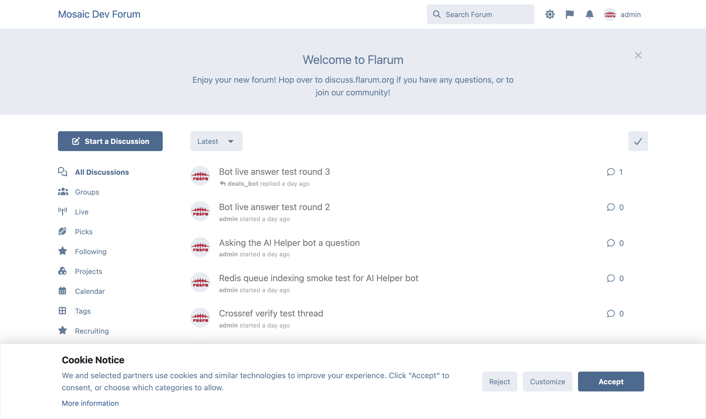
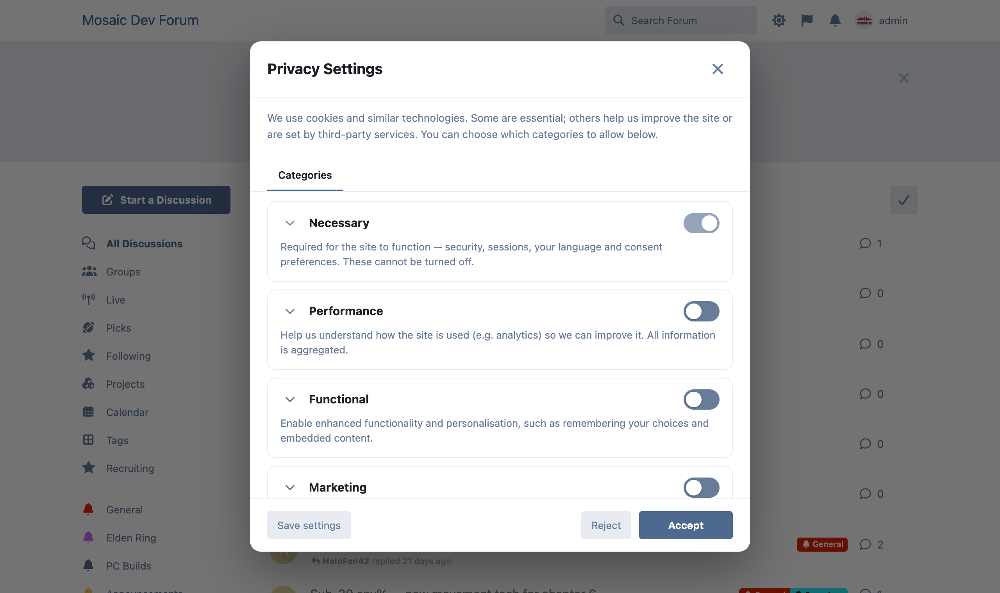
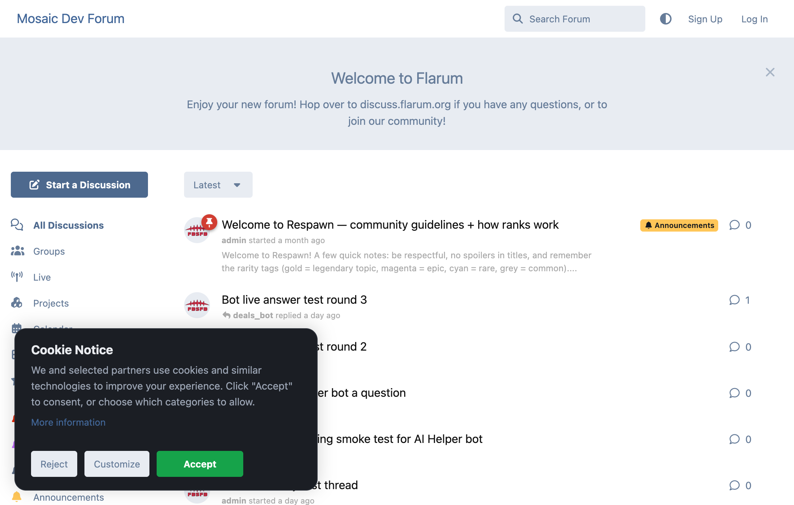

# Advanced Cookie Consent

A GDPR / ePrivacy-style **cookie consent** extension for **Flarum 2**. Free and MIT-licensed.

Shows a clean cookie notice with **Accept / Reject / Customize**, and a granular **Privacy Settings** dialog with consent categories and a per-service transparency view — and, crucially, it can **gate third-party scripts so they only load after consent**.

## Features

- **Cookie notice banner** (bottom bar, corner box, or centered) with Accept, Reject and Customize, plus your Privacy Notice link.
- **Granular Privacy Settings modal** — per-category toggles (Necessary is always on) with expandable detail, plus a **Services** tab listing the third-party services and cookies in each category.
- **Script gating** — two ways to ensure tags only run after consent:
  - Paste scripts per category in the admin panel; they load when that category is accepted.
  - Mark any script on the page as `<script type="text/plain" data-cc-category="marketing">…</script>` and it activates on consent.
- **Admin-defined categories** (rename, add, remove, mark required) — defaults: Necessary, Performance, Functional, Marketing.
- **Consent versioning** — bump the version to re-prompt everyone when your policy changes.
- **Do Not Track / Global Privacy Control** — optionally auto-reject non-essential categories when the browser sends an opt-out signal.
- **Fully stylable** — layout (bottom bar / corner box / centered), light / dark / auto theme, custom accent colour, box width and corner radius, so it fits any site and screen size.
- **Reopen anytime** — a "Cookie settings" link, plus a JS API so a theme can place its own trigger.
- Fully translatable; consent is stored locally (no personal data leaves the browser).

## Screenshots

| Cookie notice | Privacy settings |
| --- | --- |
|  |  |

Fully **stylable** so it fits any forum — choose the layout (bottom bar / corner box / centered), a light/dark/auto theme, your own accent colour, box width and corner radius:



## JavaScript API

```js
window.cookieConsent.open();             // re-open the settings dialog
window.cookieConsent.accepted('marketing'); // boolean
window.cookieConsent.onChange((c) => { /* … */ });
window.cookieConsent.acceptAll();
window.cookieConsent.rejectAll();
```

## Installation

```sh
composer require ernestdefoe/advanced-cookie-consent
php flarum cache:clear
```

Then open **Admin → Advanced Cookie Consent** to set your text, categories and scripts.

## License

[MIT](LICENSE)
